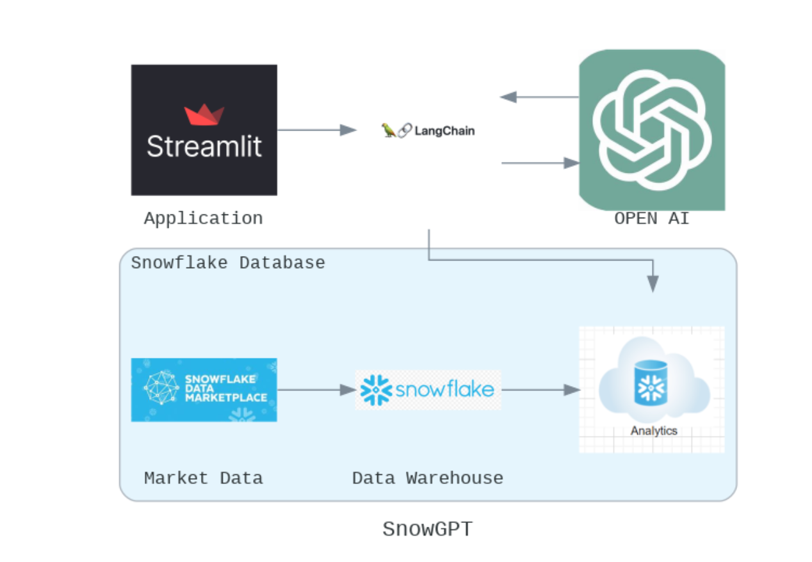
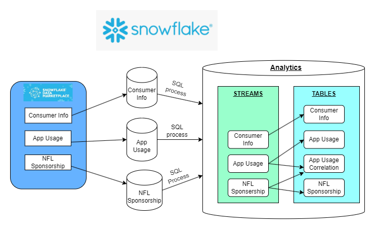
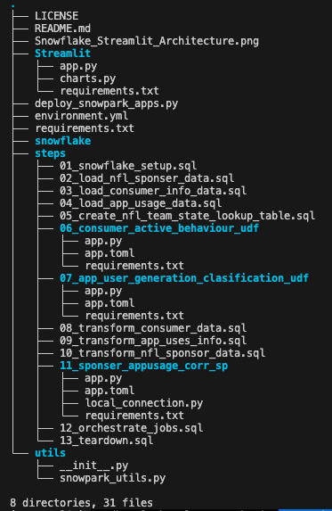

# Assignment4

## Assignment - Part 1

| Name                            | Link                                                                             |           
| ------------------------------- | ---------------------------------------------------------------------------------|
| Shardul Chavan                  | https://github.com/shardulchavan/sfguide-data-engineering-with-snowpark-python   | 
| Chinmay Gandi                   | https://github.com/chinmaygandi/sfguide-data-engineering-with-snowpark-python    | 
| Dhawal Negi                     | https://github.com/dhawalnegi1/data-engineering-with-snowpark-python             |                                                  


## Assignment - Part 2 

### Project Descrition 

In this application, the user will ask a question related to data stored in data warehouse in english language. The application will convert the english statement into SQL query and will get exectued against the snowflake databases. The results will be then displayed on the application.

The app also displays some useful analytics to give an idea of the data and insights

### Application and Documentation Link

App link - https://team2assignment4.streamlit.app/

### Project Resources

Project Demo - https://youtu.be/vD6DeUaKKtI

Project Codelabs - https://codelabs-preview.appspot.com/?file_id=1Ha-GJvJ_4nNn4plrQz33fCVaaJjFb73ZpVk_N4qm_xs#0

Proof of Concept - https://docs.google.com/document/d/1N0K34Oohp1onvOfS91-UuH7-uUOE0VP_1edQ5f1bfcY/edit

### Tech Stack
Python | Streamlit | Snowflake | Langchain | OPENAI

### Architecture diagram ###





### Project Flow

The user will ask a question related to the data in snowflake. The question which is in simple english language will be processed into an SQL query. Then the sql query is then sent to snowflake database for exection whose results are then shared into the application. 

1) Firstly, we get our data from market place and load it into the snowflake datawarehouse. Below are the datasets that we are using for this project. The data is added to individual schemas :
``` 
  Consumer data : CONSUMER_INFO
  App usage : APP_USES
  NFL post sponsership : NFL_SPONSER
```
  Now to load the data from the individual schemas we run 3 different scripts. The script contains steps to load data into various schemas that were mentioned above. 
```
  Consumer data : 03_load_consumer_info_data.sql 
  App usage : 04_load_app_usage_data.sql
  NFL post sponsership : 02_load_nfl_sponser_data.sql
```
2) We then run the 05_create_nfl_team_state_lookup_table.sql to create lookup state table that contains value of the NFL teams and respective state it belongs to.

3) We have our UDF functions written in 06_consumer_active_behaviour_udf and 07_app_user_generation_clasification_udf for consumer data and app usage data respectively.

   1) 06_consumer_active_behaviour_udf will identify what sports the individual is interested in and concat them in one column.
   
   2) 07_app_user_generation_clasification_udf will identify what generation the individual belongs to. eg GENZ or Millennial
   
4) Now we will run the below scripts to creating tables and streams into our main schema i.e. analytics schema. We will load the data into the analytics schema from the respective schemas mentioned in step 1 and then transform the data so that our tables and streams have fully refined data.
   ```
   Consumer data : 08_transform_consumer_data.sql
   App usage : 09_transform_app_uses_info.sql
   NFL post sponsership : 10_transform_nfl_sponsor_data.sql
   ```

5) We will now execute the stored procedure 11_sponser_appusage_corr_sp to get data from streams of NFL and APP USAGE and aggregate them to generate a useful table (TEAM2_DB.ANALYTICS.SPONSORSHIP_APPUSAGES_CORR) that can be used for further analysis. 

Proof of Concept (https://docs.google.com/document/d/1N0K34Oohp1onvOfS91-UuH7-uUOE0VP_1edQ5f1bfcY/edit) available to explain the data transformation and data quality checks that are done. 

### Repository Structure



### Contributions

| Name                            | Contribution                                                                 |  
| ------------------------------- | -----------------------------------------------------------------------------|
| Shardul Chavan                  | Snowflake, Langchain and Streamlit integration                                          | 
| Chinmay Gandi                   | Snowflake - SQL process, UDF Function                                        | 
| Dhawal Negi                     | Snowflake - SQL process, UDF Function, Stored Procedure                      |                                                  

### Additional Notes
WE ATTEST THAT WE HAVEN’T USED ANY OTHER STUDENTS’ WORK IN OUR ASSIGNMENT AND ABIDE BY THE POLICIES LISTED IN THE STUDENT HANDBOOK. 


